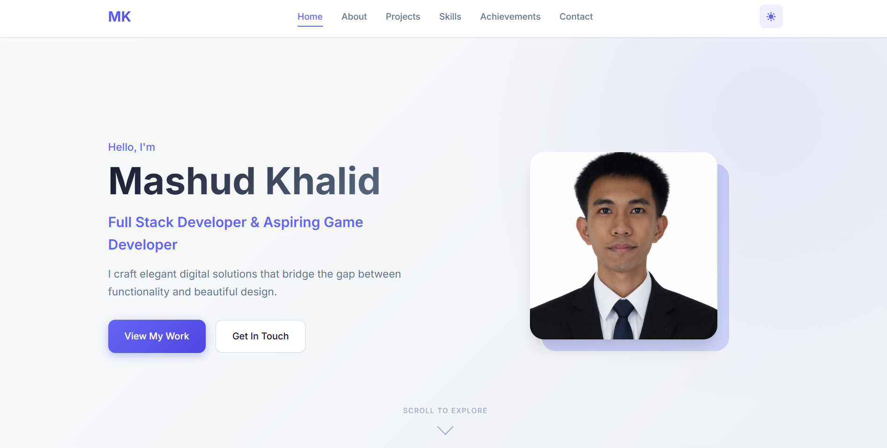

# Personal Portfolio Website

A modern, responsive personal portfolio built with vanilla **HTML**, **CSS**, and **JavaScript**.



## ✨ Features

- **Responsive layout** (desktop/tablet/mobile)
- **Light/Dark theme toggle** (saved in `localStorage`)
- **Smooth scrolling** + active nav state on scroll
- **Scroll-triggered animations** (Intersection Observer)
- **Project card tilt** interaction
- **Animated skill bars**
- **Typing effect** on the hero tagline
- **Contact form powered by Web3Forms** (no backend needed)

## 🚀 Getting Started

### Prerequisites

- A modern web browser (Chrome, Firefox, Safari, Edge)
- A code editor (VS Code recommended)

### Run locally

#### Option 1: VS Code Live Server (recommended)

1. Open the folder in VS Code
2. Install the **Live Server** extension
3. Right-click `index.html` → **Open with Live Server**

#### Option 2: Python

```bash
python -m http.server 8000
```

Open `http://localhost:8000`.

#### Option 3: Node.js

```bash
npm install -g serve
serve .
```

## 📁 Project Structure

```
PersonalPortfolio/
├── index.html              # Main page
├── styles.css              # Styling + theme variables
├── script.js               # Interactions + animations + form submit
├── CONTACT_FORM_SETUP.md   # Web3Forms setup guide
├── images/                 # Local images used by the site
└── README.md               # This file
```

## 🎨 Customization

### Update your info

Edit `index.html` and update:

- **Hero:** name, tagline, intro
- **About:** bio, approach, hobbies
- **Projects:** titles, descriptions, links, tech tags
- **Skills/Achievements:** labels and values
- **Contact:** email + social links

### Replace images

All images are in `images/`. Swap files or update the `` paths in `index.html`.

### Change theme colors

Edit the CSS variables in `styles.css`:

```css
:root {
  --color-accent: #6366f1;
  --color-accent-light: #818cf8;
  --color-accent-dark: #4f46e5;
}
```

## 📄 Resume download

The **Download Resume** button in `index.html` points to `./resume.pdf`.

To enable it:
1. Add your resume PDF to the project root
2. Name it `resume.pdf` (or update the link in `index.html`)

## 📝 Contact form (Web3Forms)

This site is already wired to **Web3Forms** in `script.js` and uses a hidden `access_key` input in the form.

- Setup instructions: see `CONTACT_FORM_SETUP.md`
- Endpoint used: `https://api.web3forms.com/submit`

## 🌐 Deployment

- **GitHub Pages:** push to GitHub → Settings → Pages → deploy from the root
- **Netlify/Vercel:** import the repo and deploy with default settings

## 🙏 Credits

- Fonts: [Inter](https://fonts.google.com/specimen/Inter) and [JetBrains Mono](https://fonts.google.com/specimen/JetBrains+Mono)
- Icons: inline SVGs in the HTML

---

Made by Mashud Khalid
