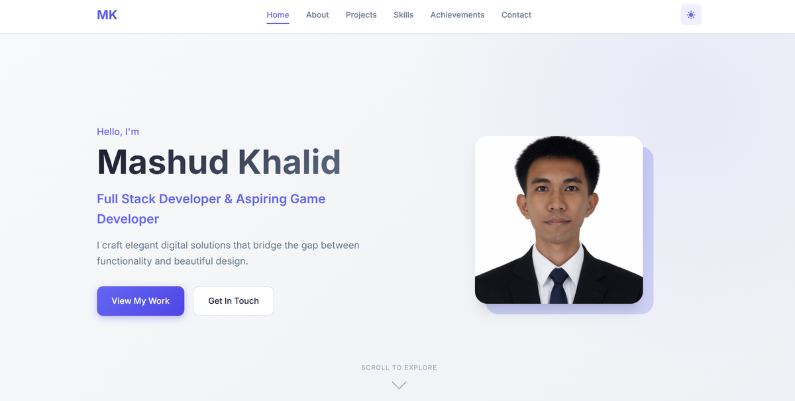

# Personal Portfolio Website

A modern, responsive personal portfolio built with vanilla **HTML**, **CSS**, and **JavaScript**.



## Features

- **Responsive layout** (desktop/tablet/mobile)
- **Light/Dark theme toggle** (saved in `localStorage`)
- **Smooth scrolling** + active nav state on scroll
- **Focused mobile project list** with expandable secondary work
- **Quiet, content-first interactions** without distracting motion
- **Accessible keyboard navigation** and reduced-motion support
- **Data-driven projects, skills, and achievements**
- **Web3Forms contact form** with hCaptcha and input limits

## Getting Started

### Prerequisites

- A modern web browser (Chrome, Firefox, Safari, Edge)
- A code editor (VS Code recommended)
- Node.js 20+ for quality checks and browser tests

### Run locally

#### Option 1: VS Code Live Server (recommended)

1. Open the folder in VS Code
2. Install the **Live Server** extension
3. Right-click `index.html` → **Open with Live Server**

#### Option 2: Python

```bash
python -m http.server 8000
```

Open `http://localhost:8000`.

#### Option 3: Node.js

```bash
npm install
npm run dev
```

## Project Structure

```
PersonalPortfolio/
├── index.html              # Main page
├── styles.css              # Styling + theme variables
├── js/                     # Content, rendering, navigation, theme, form, SEO
├── tests/                  # Playwright smoke tests and local test server
├── script.js               # Small module entry point
├── package.json            # Formatting, linting, and test commands
├── netlify.toml            # Netlify security headers
├── vercel.json             # Vercel security headers
├── robots.txt              # Search crawler policy
├── sitemap.xml             # Canonical page sitemap
├── CONTACT_FORM_SETUP.md   # Web3Forms setup guide
├── images/                 # Local images used by the site
└── README.md               # This file
```

## Customization

### Update your info

Edit `index.html` for page copy and contact details. Edit `js/content.js` for repeated collections:

- **Hero:** name, tagline, intro
- **About:** bio, approach, hobbies
- **Projects:** titles, descriptions, links, tech tags
- **Skills/Achievements:** labels and values
- **Contact:** email + social links

### Replace images

All images are in `images/`. Swap files or update the `` paths in `index.html`.

### Change theme colors

Edit the CSS variables in `styles.css`:

```css
:root {
  --color-accent: #9c4c2d;
  --color-accent-light: #bd6b48;
  --color-accent-dark: #74351f;
}
```

## Resume download

The **Download Resume** button in `index.html` points to `./resume.pdf`.

To enable it:

1. Add your resume PDF to the project root
2. Name it `resume.pdf` (or update the link in `index.html`)

## Contact form (Web3Forms)

This site is wired to **Web3Forms** in `js/contact.js` and uses a public `access_key` input in the form.

- Setup instructions: see `CONTACT_FORM_SETUP.md`
- Endpoint used: `https://api.web3forms.com/submit`

## Deployment

- **GitHub Pages:** push to GitHub → Settings → Pages → deploy from the root
- **Netlify/Vercel:** import the repo and deploy with default settings. Included configs apply security headers.
- **GitHub Pages:** cannot apply repository-defined HTTP headers. Use Netlify or Vercel when headers are required.

Update canonical URLs in `index.html`, `js/seo.js`, `robots.txt`, and `sitemap.xml` if the production URL changes.

## Quality checks

```bash
npm run format:check
npm run lint
npm test
npm run audit
```

## Credits

- Fonts: system sans-serif and monospace stacks; no font-network dependency
- Icons: [Font Awesome](https://fontawesome.com/) (self-hosted in `vendor/fontawesome/`) + inline SVGs for theme toggle and contact links

---

Made by Mashud Shamsher Khalid
